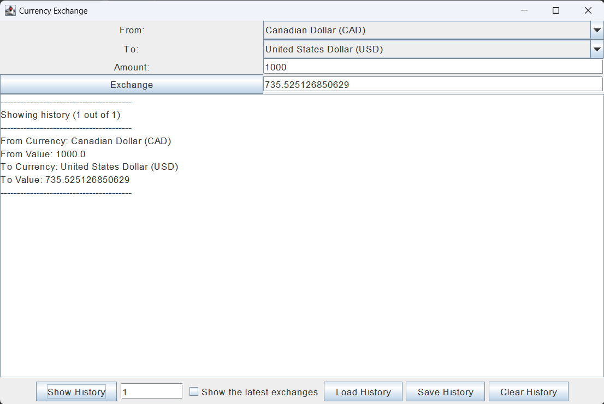

# Currency Exchange Application

## Created in Java for CPSC 210

I am creating a currency exchange app for this project.
Users use this app to convert an amount of money from one currency (e.g. CAD) to another (e.g. USD).
Users select two currencies from **31 unique selections**, enter the amount they want to convert in the "from" currency section, and the app will automatically display the converted amount in the "to" currency section.
This app is useful to users such as international students, travelers, and people interested in exchanging currency.

This project is interesting to me because it's an opportunity to apply my knowledge of JUnit testing, data structures, and GUI in Java. 
Also, it's an opportunity to create an app that's useful for different groups of people.

# User Stories

-  As a user, I want to be able to add an exchange to a list that shows the history of exchanges.

-  As a user, I want to be able to view the list of all my previous currency exchanges.

-  As a user, I want to be able to select two currency names for the "from" and "to" currency selections, respectively, manually enter an amount in the "from" currency section, and then see the converted amount in the "to" currency section.

-  As a user, I want to be able to clear the history of currency exchanges.

-  As a user, I want to be able to load the history of currency exchanges from a JSON file (if I choose to do so).

-  As a user, I want to be able to save the updated history of exchanges to a JSON file (if I choose to do so).

-  As a user, I want to be able to add multiple exchanges to a list of previous exchanges.

-  As a user, I want to be able to load and save the state of the application.

# Instructions for Grader

-  You can generate the first required action related to the user story "adding multiple Xs to a Y" by entering a number next to the "Amount:" label and pressing "Exchange".
-  You can generate the second required action related to the user story "adding multiple Xs to a Y" by entering a number (let's call this number X) next to the "Show History" button to view all exchanges or a subset of X earliest exchanges, as if you are viewing a Queue. Checking the "Show the latest exchanges" checkbox will show you a reversed history, as if you are viewing a Stack.
-  You can save the state of my application by clicking on the "Save History" button at the bottom.
-  You can reload the state of my application by clicking on the "Load History" button at the bottom.
-  You can locate my visual component by loading or saving history by clicking the corresponding buttons to create a pop-up image showing the app status: "Running" or "IOException". If the input next to the "Show History" button is not an integer, a pop-up image will also appear, telling you that "NumberFormatException" was thrown. This happens because `Integer.parseInt()` cannot parse a String that contains letters or a double.

